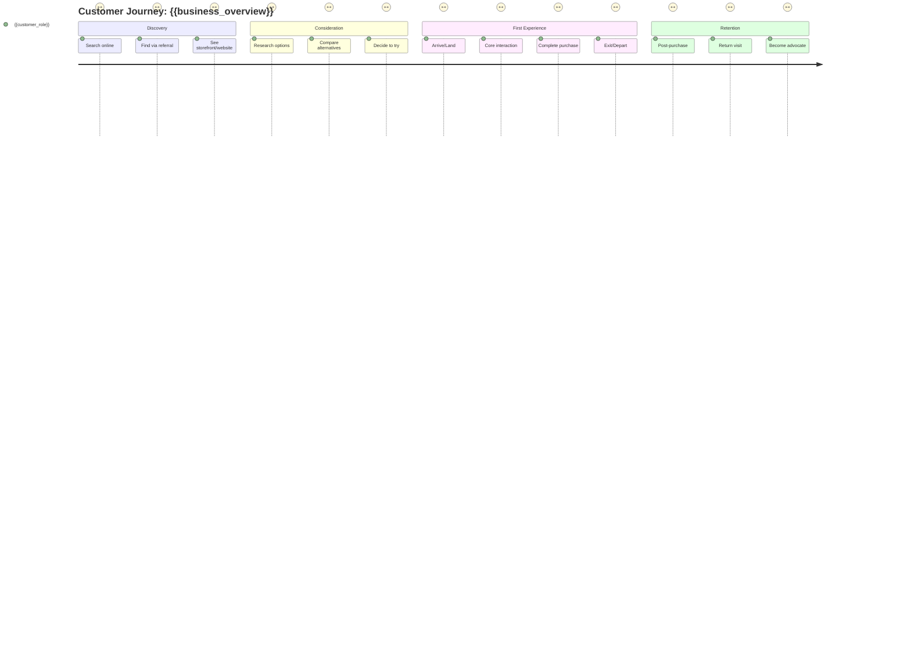

# Customer Journey Map

**Created:** {{date}}
**Business:** {{business_overview}}
**Target Customer:** {{target_customer}}
**Created by:** Valentina - Customer Journey Cartographer

---

## Executive Summary

{{business_model}}

**Current Challenges:** {{current_challenges}}

**Key Findings:**

- {{key_finding_1}}
- {{key_finding_2}}
- {{key_finding_3}}

---

## Visual Journey Map

---

## Stage 1: Discovery 🔍

### How Customers Find You

**Top Awareness Channels:**
{{awareness_channels}}

**Customer Search Behavior:**
{{search_behavior}}

**First Impressions:**
{{first_impression}}

**Referral Patterns:**
{{referral_patterns}}

### Discovery Strengths

- {{discovery_strength_1}}
- {{discovery_strength_2}}

### Discovery Gaps

- {{discovery_gap_1}}
- {{discovery_gap_2}}

---

## Stage 2: Consideration 🤔

### Research and Decision Making

**Information Seeking:**
{{information_seeking}}

**Trust Building Elements:**
{{trust_building}}

**Decision Triggers:**
{{decision_triggers}}

**Barriers to Entry:**
{{consideration_barriers}}

### Consideration Strengths

- {{consideration_strength_1}}
- {{consideration_strength_2}}

### Consideration Gaps

- {{consideration_gap_1}}
- {{consideration_gap_2}}

---

## Stage 3: First Experience ⭐

### The Make-or-Break Moment

**Arrival Experience:**
{{arrival_moment}}

**Core Service Interaction:**
{{core_service_interaction}}

**Wait Times:**
{{wait_times}}

**Environment:**
{{physical_environment}}{{digital_experience}}

**Payment/Checkout:**
{{payment_checkout}}

**Departure Experience:**
{{departure_experience}}

### Experience Strengths

- {{experience_strength_1}}
- {{experience_strength_2}}
- {{experience_strength_3}}

### Experience Gaps

- {{experience_gap_1}}
- {{experience_gap_2}}

---

## Stage 4: Retention & Loyalty 🔁

### Turning Customers into Advocates

**Follow-Up System:**
{{follow_up_system}}

**Loyalty Drivers:**
{{repeat_customer_drivers}}

**Churn Reasons:**
{{churn_reasons}}

**Win-Back Strategies:**
{{winback_attempts}}

**Advocacy Triggers:**
{{advocacy_triggers}}

### Retention Strengths

- {{retention_strength_1}}
- {{retention_strength_2}}

### Retention Gaps

- {{retention_gap_1}}
- {{retention_gap_2}}

---

## Touchpoint Inventory

| Stage         | Touchpoint       | Channel       | Current State | Opportunity       |
| ------------- | ---------------- | ------------- | ------------- | ----------------- |
| Discovery     | {{touchpoint_1}} | {{channel_1}} | {{state_1}}   | {{opportunity_1}} |
| Discovery     | {{touchpoint_2}} | {{channel_2}} | {{state_2}}   | {{opportunity_2}} |
| Consideration | {{touchpoint_3}} | {{channel_3}} | {{state_3}}   | {{opportunity_3}} |
| Consideration | {{touchpoint_4}} | {{channel_4}} | {{state_4}}   | {{opportunity_4}} |
| Experience    | {{touchpoint_5}} | {{channel_5}} | {{state_5}}   | {{opportunity_5}} |
| Experience    | {{touchpoint_6}} | {{channel_6}} | {{state_6}}   | {{opportunity_6}} |
| Experience    | {{touchpoint_7}} | {{channel_7}} | {{state_7}}   | {{opportunity_7}} |
| Retention     | {{touchpoint_8}} | {{channel_8}} | {{state_8}}   | {{opportunity_8}} |
| Retention     | {{touchpoint_9}} | {{channel_9}} | {{state_9}}   | {{opportunity_9}} |

---

## Emotional Journey Arc

**Highest Point (Peak Delight):**

- When: {{emotional_peaks}}
- Why: {{emotional_peak_reason}}

**Lowest Point (Biggest Frustration):**

- When: {{biggest_friction_moment}}
- Why: {{friction_reason}}

**Critical Moment (Make-or-Break):**

- When: {{critical_touchpoint}}
- Impact: {{critical_impact}}

---

## Friction Points Analysis

### High Priority Friction (Fix First)

#### Friction Point #1: {{friction_1_name}}

- **Where:** {{friction_1_stage}}
- **What happens:** {{common_complaints_1}}
- **Customer impact:** {{friction_1_impact}}
- **Root cause:** {{friction_1_cause}}
- **Quick fix:** {{friction_1_solution}}

#### Friction Point #2: {{friction_2_name}}

- **Where:** {{friction_2_stage}}
- **What happens:** {{abandonment_points_1}}
- **Customer impact:** {{friction_2_impact}}
- **Root cause:** {{friction_2_cause}}
- **Quick fix:** {{friction_2_solution}}

#### Friction Point #3: {{friction_3_name}}

- **Where:** {{friction_3_stage}}
- **What happens:** {{confusion_moments_1}}
- **Customer impact:** {{friction_3_impact}}
- **Root cause:** {{friction_3_cause}}
- **Quick fix:** {{friction_3_solution}}

### Medium Priority Friction

- {{friction_4}}
- {{friction_5}}
- {{friction_6}}

### Accessibility Barriers

{{accessibility_issues}}

---

## Delight Opportunities

### Current Wow Moments

{{current_wow_moments}}

### Personalization in Place

{{personalization_current}}

### New Delight Ideas

1. **{{delight_idea_1}}**
   - Stage: {{delight_stage_1}}
   - How: {{delight_how_1}}
   - Impact: {{delight_impact_1}}

2. **{{delight_idea_2}}**
   - Stage: {{delight_stage_2}}
   - How: {{delight_how_2}}
   - Impact: {{delight_impact_2}}

3. **{{delight_idea_3}}**
   - Stage: {{delight_stage_3}}
   - How: {{delight_how_3}}
   - Impact: {{delight_impact_3}}

---

## Competitive Context

### Main Competitors

{{main_competitors}}

### What They Do Better

{{competitor_strengths}}

### Your Competitive Advantages

{{your_advantages}}

### Switching Barriers (Why Customers Stay)

{{switching_barriers}}

### Competitive Journey Gaps

- Areas where competitors excel: {{competitive_gap_1}}
- Your unique journey strengths: {{unique_strength_1}}

---

## 10 Quick Wins Action Plan

### 🔥 Tier 1: High Impact / Easy Implementation (DO FIRST)

#### Quick Win #1: {{quick_win_1_name}}

- **Problem Solved:** {{quick_win_1_problem}}
- **Solution:** {{quick_win_1_solution}}
- **Impact:** High
- **Effort:** Easy
- **How to Implement:** {{quick_win_1_how}}
- **Owner:** {{quick_win_1_owner}}
- **Timeline:** Week 1

#### Quick Win #2: {{quick_win_2_name}}

- **Problem Solved:** {{quick_win_2_problem}}
- **Solution:** {{quick_win_2_solution}}
- **Impact:** High
- **Effort:** Easy
- **How to Implement:** {{quick_win_2_how}}
- **Owner:** {{quick_win_2_owner}}
- **Timeline:** Week 1-2

#### Quick Win #3: {{quick_win_3_name}}

- **Problem Solved:** {{quick_win_3_problem}}
- **Solution:** {{quick_win_3_solution}}
- **Impact:** High
- **Effort:** Easy
- **How to Implement:** {{quick_win_3_how}}
- **Owner:** {{quick_win_3_owner}}
- **Timeline:** Week 2

### ⭐ Tier 2: High Impact / Moderate Effort (NEXT)

#### Quick Win #4: {{quick_win_4_name}}

- **Problem:** {{quick_win_4_problem}}
- **Solution:** {{quick_win_4_solution}}
- **Timeline:** Week 3

#### Quick Win #5: {{quick_win_5_name}}

- **Problem:** {{quick_win_5_problem}}
- **Solution:** {{quick_win_5_solution}}
- **Timeline:** Week 3-4

#### Quick Win #6: {{quick_win_6_name}}

- **Problem:** {{quick_win_6_problem}}
- **Solution:** {{quick_win_6_solution}}
- **Timeline:** Week 4

### 💡 Tier 3: Medium Impact / Easy Wins (REFINEMENTS)

#### Quick Win #7: {{quick_win_7_name}}

- **Solution:** {{quick_win_7_solution}}
- **Timeline:** Month 2

#### Quick Win #8: {{quick_win_8_name}}

- **Solution:** {{quick_win_8_solution}}
- **Timeline:** Month 2

#### Quick Win #9: {{quick_win_9_name}}

- **Solution:** {{quick_win_9_solution}}
- **Timeline:** Month 2

#### Quick Win #10: {{quick_win_10_name}}

- **Solution:** {{quick_win_10_solution}}
- **Timeline:** Month 2

---

## Implementation Timeline

### Week 1-2: Foundation

- ✅ Implement Quick Win #1
- ✅ Implement Quick Win #2
- ✅ Start Quick Win #3
- 📊 Begin tracking baseline metrics

### Week 3-4: Momentum

- ✅ Complete Quick Win #3
- ✅ Implement Quick Wins #4-6
- 📊 Measure improvements from Wins #1-2

### Month 2: Optimization

- ✅ Implement Quick Wins #7-10
- 📊 Comprehensive metrics review
- 🔄 Iterate based on results

### Ongoing

- Monthly journey review
- Continuous customer feedback collection
- Track and celebrate improvements

---

## Success Metrics

### Discovery Metrics

- **Track:** Website traffic, foot traffic, new customer source breakdown
- **Goal:** {{discovery_goal}}
- **Current:** {{discovery_baseline}}

### Consideration Metrics

- **Track:** Time to first purchase, inquiry-to-customer conversion rate
- **Goal:** {{consideration_goal}}
- **Current:** {{consideration_baseline}}

### Experience Metrics

- **Track:** Customer satisfaction score (CSAT), Net Promoter Score (NPS), service completion rate
- **Goal:** {{experience_goal}}
- **Current:** {{experience_baseline}}

### Retention Metrics

- **Track:** Repeat purchase rate, customer lifetime value, churn rate, referral rate
- **Goal:** {{retention_goal}}
- **Current:** {{retention_baseline}}

---

## Monthly Review Checklist

Use this checklist to review your journey monthly:

- [ ] Review metrics across all stages
- [ ] Collect customer feedback (surveys, reviews, direct comments)
- [ ] Analyze new friction points
- [ ] Identify new delight opportunities
- [ ] Check progress on quick wins
- [ ] Update journey map with changes
- [ ] Celebrate improvements with team
- [ ] Set priorities for next month

---

## Key Takeaways

**Your Journey Map Reveals:**

1. {{key_takeaway_1}}
2. {{key_takeaway_2}}
3. {{key_takeaway_3}}

**Critical Friction Points:**

- {{critical_friction_1}}
- {{critical_friction_2}}

**Biggest Opportunities:**

- {{biggest_opportunity_1}}
- {{biggest_opportunity_2}}

**Next 30 Days Priority:**
{{implementation_priority}}

---

_Customer Journey Map created on {{date}} using BMAD Creative Intelligence Suite - Customer Journey Mapping workflow. Created by Valentina - Customer Journey Cartographer._
